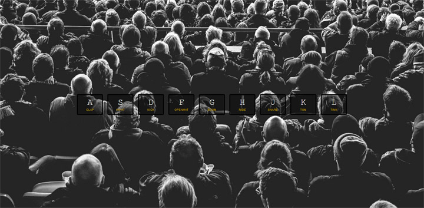

# Basic JavaScript Drum Kit
**Tutorial by Wes Bos, JavaScript30**

### Objects learned:
* Key Events
* Playing audio
* Listening to the transition end event

[#JavaScript30](https://javascript30.com/)